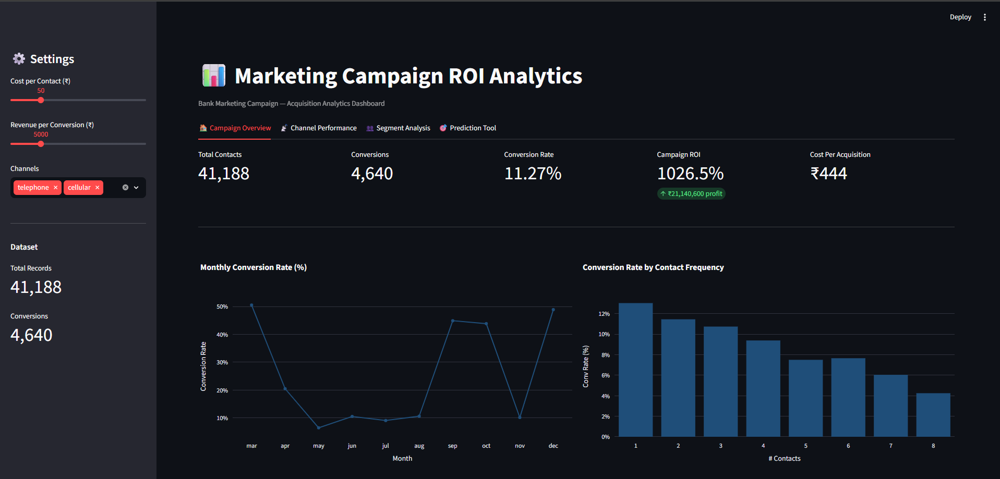
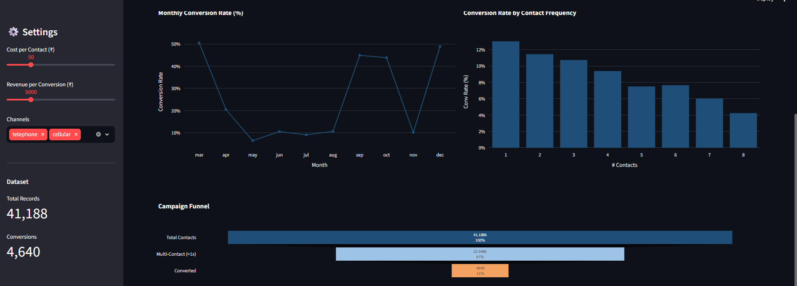
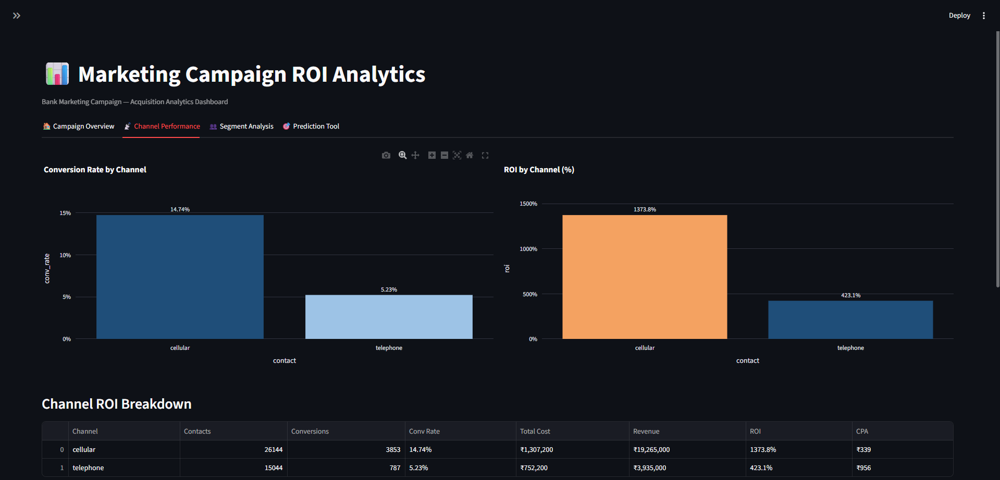
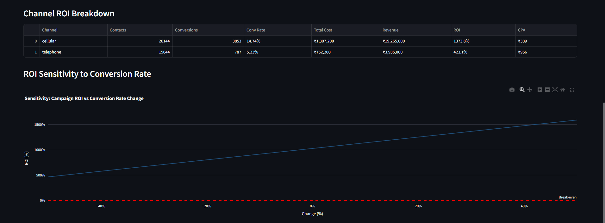
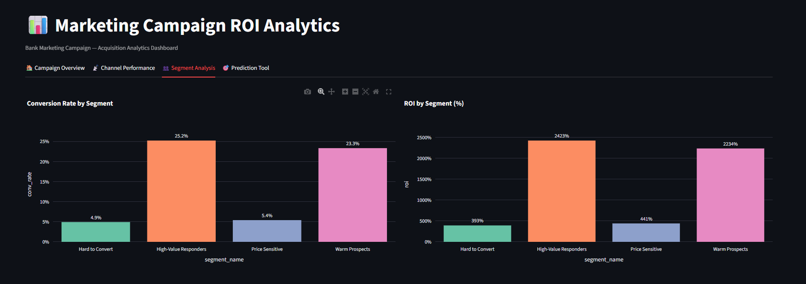
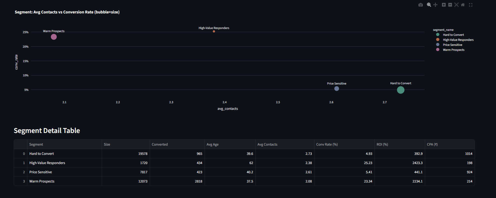
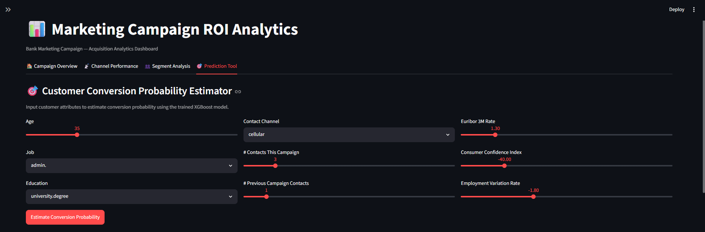
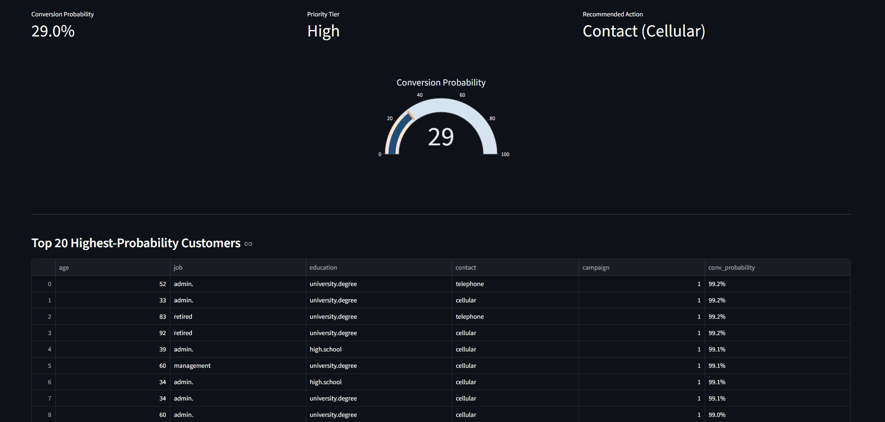

# 📊 Marketing Campaign ROI Analytics

> End-to-end campaign measurement analytics project — EDA, A/B testing, customer segmentation, conversion prediction, and ROI quantification on 45,000+ real telemarketing campaign records.

---

## 🔍 Business Problem

A bank ran a telemarketing acquisition campaign across two channels (cellular and telephone) targeting potential term deposit subscribers. The business needs to answer:

- **Which channel drives higher ROI?** Is the difference statistically significant?
- **Which customers are most likely to convert?** Can we rank them to reduce wasted contacts?
- **What is the true ROI of this campaign?** How does it break down by channel and segment?
- **What should we do differently next cycle?** Data-driven recommendations for leadership.

---

## 🔑 Key Findings

| Finding | Result |
|---|---|
| **Cellular vs Telephone lift** | +182% higher conversion rate (14.74% vs 5.23%, p < 0.001) |
| **Cellular ROI** | 1,373.8% vs Telephone 423.1% — 3x higher |
| **Cellular CPA** | ₹339 vs ₹956 for telephone — 65% cheaper per acquisition |
| **Optimal contact frequency** | 1 contact; diminishing returns begin at 2, drops sharply after 3 |
| **High-Value Responders segment** | 25.2% conversion rate, 2,423% ROI — avg age 62, retired profiles |
| **Warm Prospects segment** | 23.3% conversion rate, 2,234% ROI — largest valuable segment (12,073 records) |
| **XGBoost model** | Top drivers: call duration, emp_var_rate, nr_employed, euribor3m |
| **Overall campaign ROI** | 1,026.5% — ₹21,140,600 profit on ₹2,059,400 spend |

---

## 📊 Dashboard

### Campaign Overview


*41,188 contacts · 4,640 conversions · 11.27% conversion rate · 1,026.5% ROI · ₹444 CPA*



*Campaign funnel: 41,188 contacted → 23,546 multi-contact (57%) → 4,640 converted (11%)*

---

### Channel Performance


*Cellular: 14.74% conversion, 1,373.8% ROI, ₹339 CPA · Telephone: 5.23% conversion, 423.1% ROI, ₹956 CPA*



*ROI stays well above break-even even if conversion rate drops 50% — campaign has strong safety margin*

---

### Segment Analysis


*High-Value Responders (25.2% conv rate, 2,423% ROI) and Warm Prospects (23.3%, 2,234%) drive the majority of campaign value*



*Bubble chart: High-Value Responders and Warm Prospects convert at 5x the rate of Hard-to-Convert segment with fewer contacts needed*

| Segment | Size | Conv Rate | ROI | CPA (₹) | Avg Age |
|---|---|---|---|---|---|
| High-Value Responders | 1,720 | 25.2% | 2,423% | ₹198 | 62 |
| Warm Prospects | 12,073 | 23.3% | 2,234% | ₹214 | 37.5 |
| Price Sensitive | 7,817 | 5.4% | 441% | ₹924 | 40.2 |
| Hard to Convert | 19,578 | 4.9% | 393% | ₹1,014 | 39.6 |

---

### Prediction Tool




*Interactive estimator: input customer attributes → real-time conversion probability gauge + Top 20 highest-probability customers ranked by model score*

---

## 📁 Project Structure

```
marketing-campaign-roi-analytics/
├── assets/                             # Dashboard screenshots for README
├── data/
│   ├── raw/                            # bank-additional-full.csv (download separately)
│   └── processed/                      # cleaned, segmented, scored CSVs
├── notebooks/
│   ├── 01_data_cleaning.ipynb          # Data quality, feature engineering
│   ├── 02_eda_campaign_performance.ipynb  # Channel, month, job-level EDA
│   ├── 03_ab_testing.ipynb             # Z-test, chi-square, t-test
│   ├── 04_customer_segmentation.ipynb  # K-Means, PCA, segment profiling
│   ├── 05_conversion_prediction.ipynb  # XGBoost, SHAP, cumulative gain
│   └── 06_roi_measurement.ipynb        # CPA, ROI, sensitivity analysis
├── src/
│   ├── data_cleaning.py                # Cleaning pipeline
│   ├── eda_utils.py                    # Reusable plotting helpers
│   ├── ab_testing.py                   # Statistical testing functions
│   ├── segmentation.py                 # K-Means + profiling
│   ├── model.py                        # Logistic Regression + XGBoost + SHAP
│   └── roi_calculator.py               # ROI, CPA, lift, sensitivity
├── dashboard/
│   └── app.py                          # Streamlit 4-tab interactive dashboard
├── reports/
│   ├── figures/                        # Auto-saved charts from notebooks
│   └── findings.md                     # Business-facing recommendations report
└── requirements.txt
```

---

## 🛠️ Tech Stack

`Python` · `Pandas` · `Scikit-learn` · `XGBoost` · `SHAP` · `SciPy` · `Streamlit` · `Plotly` · `Matplotlib` · `Seaborn`

---

## 🚀 Getting Started

### 1. Clone the repository
```bash
git clone https://github.com/Bhumi-singh/marketing-campaign-roi-analytics.git
cd marketing-campaign-roi-analytics
```

### 2. Install dependencies
```bash
pip install -r requirements.txt
```

### 3. Download the dataset
Download `bank-additional-full.csv` from [UCI Machine Learning Repository](https://archive.ics.uci.edu/dataset/222/bank+marketing) and place it in `data/raw/`.

### 4. Run notebooks in order
```bash
jupyter notebook
# Run 01 → 02 → 03 → 04 → 05 → 06
```

### 5. Launch the dashboard
```bash
streamlit run dashboard/app.py
```

---

## 📐 Analytical Methods

| Notebook | Methods Applied |
|---|---|
| 01 — Data Cleaning | Missing value handling, outlier treatment, feature engineering (age bands, season, contact recency) |
| 02 — EDA | Conversion rate analysis by channel/month/job/age, contact frequency curve, funnel visualization |
| 03 — A/B Testing | Two-proportion Z-test, chi-square test of independence, independent t-test, incremental lift |
| 04 — Segmentation | K-Means clustering (k=4), elbow + silhouette selection, PCA visualization, segment profiling |
| 05 — Prediction | Logistic Regression + XGBoost, ROC-AUC, Precision-Recall, SHAP importance, cumulative gain curve |
| 06 — ROI | CPA calculation, channel-level ROI, incremental lift ROI, break-even analysis, sensitivity analysis |

---

## 📄 Business Report

See [`reports/findings.md`](reports/findings.md) for the full business-facing analysis including:
- Channel ROI breakdown with exact figures
- Segment prioritization recommendations
- Predicted ROI improvement under optimized targeting strategy
- Recommended actions for next campaign cycle

---

## 📦 Dataset

**Bank Marketing Dataset** — UCI Machine Learning Repository
- 41,188 records · 21 features (after cleaning)
- Real Portuguese bank telemarketing campaign data (2008–2013)
- Target: whether client subscribed to a term deposit

---

## 👩‍💻 Author

**Bhumi Singh** — Data Analyst  
B.Tech Electronics & Communication Engineering, RCOEM Nagpur (CGPA: 8.67)  
[GitHub](https://github.com/Bhumi-singh) · [LinkedIn](https://linkedin.com/in/bhumi-singh)  
singhbhumi0927@gmail.com
